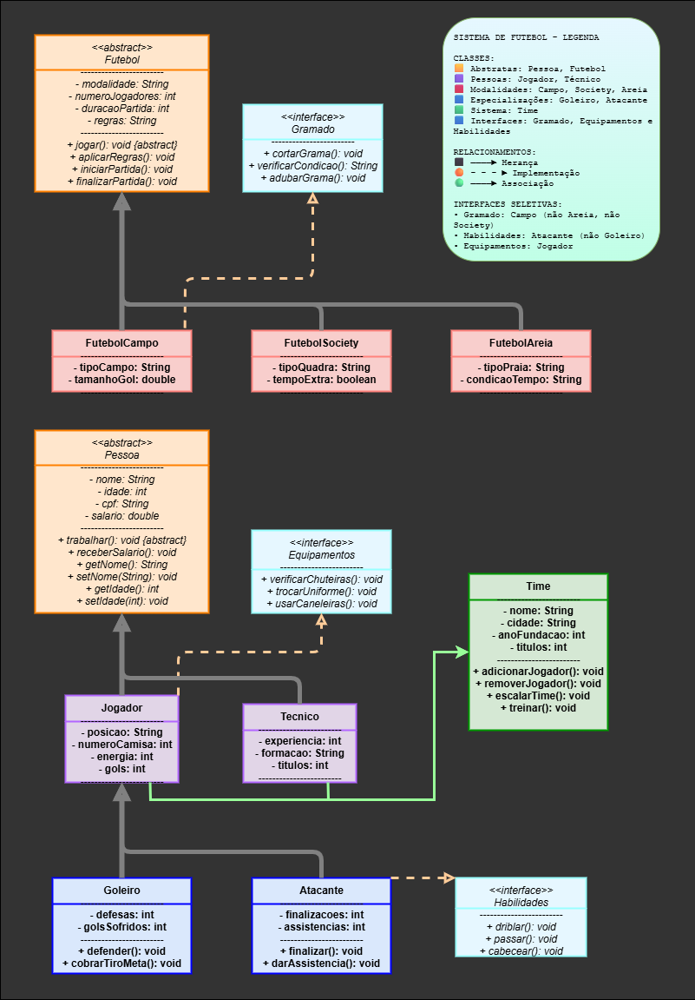

#  📊 Diagrama e Relações de Classes 
## ⚽ Gerenciamento de Futebol

Este projeto modela entidades relacionadas a um sistema de gerenciamento de futebol, utilizando conceitos de orientação a objetos (Java). Abaixo, descrevo as principais classes, interfaces e suas relações.
 ***
##  🏗️ Classes Principais

- **Pessoa**  *abstract class* ( superclass de Jogador e Tecnico )
  - Representa uma pessoa genérica ( nome, idade, cpf, salário, etc )
 
- **Tecnico extends Pessoa**
  - Representa o técnico do time
  
- **Jogador ( extends Pessoa, implements Equipamentos )**
  - Representa um jogador de futebol ( posição, número da camisa, energia, gols )
  - Métodos de Equipamentos: verificarChuteiras, trocarUniforme, usarCaneleiras
   
- **Goleiro ( extends Jogador )**
  - Especialização de Jogador ( defesas, gols sofridos )
  - Métodos específicos: defender(), cobrarTiroDeGol()
   
- **Atacante ( extends Jogador, implements Habilidades )**
  - Especialização de Jogador ( finalizações, assistências )
  - Métodos específicos: finalizar(), darAssistencia(), driblar(), passar(), cabecear()
  
- **Futebol**  *abstract class*  ( superclass de FutebolCampo, FutebolSociety, FutebolAreia )
  - Superclasse para modalidades de futebol ( modalidade, número de jogadores, duração da partida )
  - Método abstrato iniciarJogo()
  
- **FutebolCampo, FutebolSociety, FutebolAreia ( extends Futebol )**
  - Especializações para diferentes tipos de futebol ( campo, society, areia ), cada uma com atributos próprios
    
- **Time**
  - Representa um time de futebol ( nome, cidade, ano de fundação, títulos )
  - Possui lista de jogadores e um técnico
  - Métodos para adicionar/remover jogadores, escalar time, treinar

 ***
## 🎯 Interfaces

- **Equipamentos**
  - Implementada por Jogador
- **Habilidades**
  - Implementada por Atacante
- **Gramado**
  - Métodos: cortarGrama(), verificarCondicao(), adubarGramado()
 ***
## 📱 Diagrama Visual

Abaixo está um diagrama de exemplo:


 ***
## 📚 Relações Explicadas

- **Herança**:
  - Jogador herda Pessoa, Goleiro e Atacante herdam Jogador.
  - Futebol é classe abstrata para FutebolCampo, FutebolSociety, FutebolAreia.
- **Composição**:
  - Time possui uma lista de Jogadores e um Técnico.
- **Implementação de Interfaces**:
  - Jogador implementa Equipamentos ( funções relacionadas a equipamentos esportivos ).
  - Atacante implementa Habilidades ( funções como driblar, passar, cabecear ).
  - FutebolCampo implementa Gramado ( funções relacionadas ao gramado ).

 ***
## 📁 Estrutura do Projeto

```
src/
└── diagrama_futebol/
    ├── Main.java              # Sistema interativo principal
    ├── Pessoa.java            # Classe abstrata base
    ├── Time.java              # Gerenciamento de times
    ├── Tecnico.java           # Classe para técnicos
    ├── Jogador.java           # Classe base para jogadores
    ├── Atacante.java          # Especialização de jogador
    ├── Goleiro.java           # Especialização de jogador
    ├── Equipamentos.java      # Interface para equipamentos
    ├── Habilidades.java       # Interface para habilidades
    ├── Futebol.java           # Classe abstrata para modalidades
    ├── FutebolCampo.java      # Modalidade futebol de campo
    ├── FutebolSociety.java    # Modalidade futebol society
    └── FutebolAreia.java      # Modalidade futebol de areia
```
 ***
## 📚 Conceitos de POO Aplicados

- **Herança**: Pessoa → Jogador → Atacante/Goleiro
- **Polimorfismo**: Método trabalhar() implementado diferentemente
- **Interfaces**: Equipamentos e Habilidades
- **Encapsulamento**: Atributos privados com getters/setters
- **Abstração**: Classes abstratas Pessoa e Futebol
